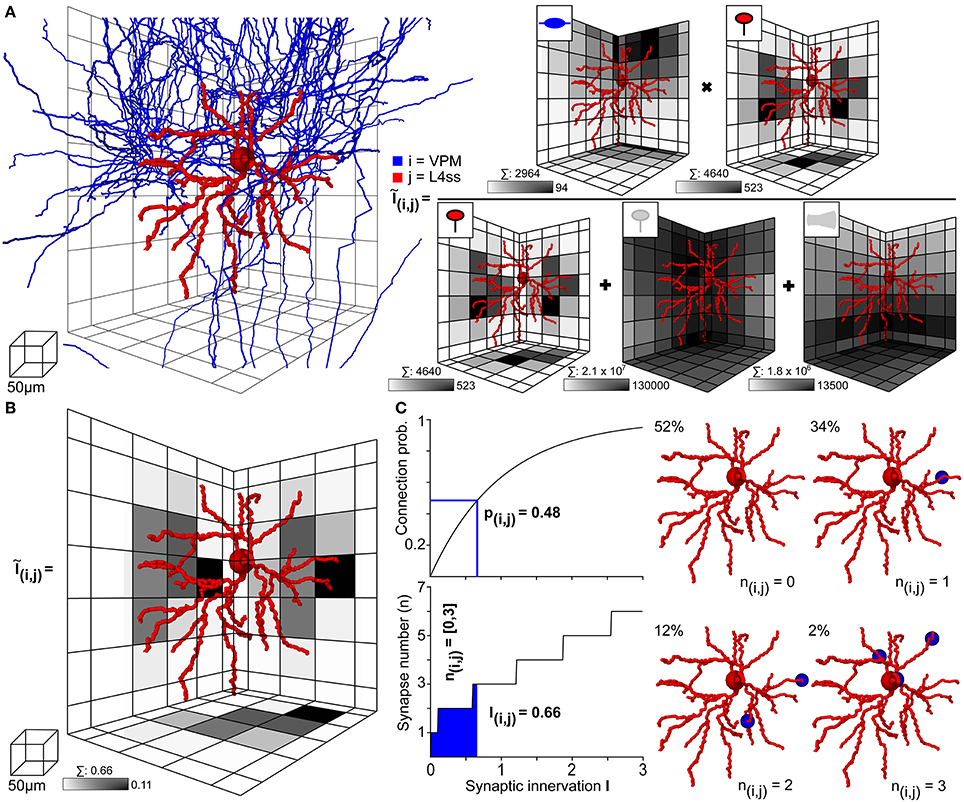
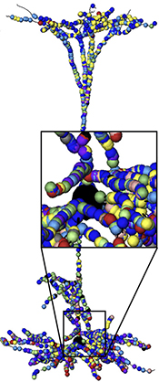

# Single cell input mapper

## Command-line tool to model synaptic inputs to neuron reconstructions

Detailed models of signal processing in neurons and neural networks require knowledge of the number and spatial 
distribution of synapses (often with different functional properties) connecting neurons. 
This tool is an implementation of the model presented in [Egger et al.](https://www.frontiersin.org/articles/10.3389/fnana.2014.00129/full),
which uses anatomical data to provide an estimate of synaptic connectivity to 
single neurons.

Input:
1. Neuron reconstruction containing dendrite and soma morphology
2. 3D scalar fields describing neural network architecture
3. Metadata tables describing cell type-specific connection properties

Software dependencies:
numpy >= 1.6.2 (may work with older versions, but no guarantees)

Usage:

`python map_singlecell_inputs.py [morphology filename] [postsynaptic cell type name]`

The tool then creates 50 realizations of the statistical model described in the link above and provides the realization 
closest to the ensemble mean as an output.

Illustration of the statistical model

The ouput of the model can be used for analysis of synaptic innervation or to develop biophysical models of 
information processing in single neurons. For example, this tool was used to set up the model in my [paper describing
gating of sensory signals](https://www.sciencedirect.com/science/article/pii/S0896627319308840):

Illustration of synaptic inputs to model neuron

The implementation of the biophysical model can be found [here](https://senselab.med.yale.edu/modeldb/ShowModel.cshtml?model=239145).
